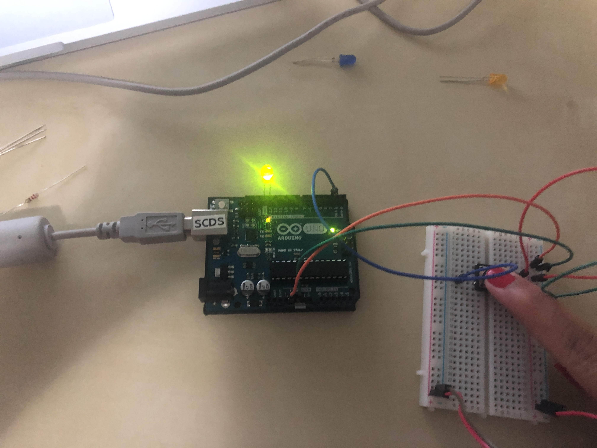

Electronics for the rest of us!

## Day 1: Reflection


The first day of this module was quite informative for me. We went over an introduction to the module and due to the kits not arriving on time we skipped ahead and went over how to use Github. This was my first time using the program and I had some issues with creating a repository. My problems were resolved with assistance and I think that going forward practicing  the functions of the website will help me with this issue.  I come from a Commerce background  and am currently finishing up my third year in the program. This course initially sparked my attention when I saw a post on avenue about a new course being offered in the spring term. As I am finishing up my degree I wanted to take more courses that are not related to my specialization to widen my horizons. The electronics module came into my interest as I have never taken a course related to electronics/coding or even done it for leisure. This seemed like an excellent opportunity to learn something new. My expectations from this course are to establish an introduction to GitHub and learn to learn basic info about how circuit boards work. The only background I have is from high school science, where I vaguely remember series and parallel circuits. I hope to use this week gain my understanding of circuits and even create a device that can be used to perform an everyday activity. 





## Day 2: Results

[Here is a link to my Arduino sketch for day 2](https://github.com/inspire-1a03/intersession-2020-MudrikaJoshi/blob/master/RGB_LED.ino)

The device that I made today works as a weather station. It reads the temperature of the room from a thermistor and an led lights up when the temperatures reach a certain number. The range is from 15 to 20 degrees. The most challenging part of making this device was getting the wiring to be correct and making the code set to the right temperatures. The wiring was the first challenge I dealt with, the light on the LED was not turning on at first; I had to change the wiring on the breadboard as my divide had a common cathode. The second challenge was the code on Arduino, the temperature is not very high in my room and it is hard to get it to 30 degrees, so I changed the code to a lower temperature to make my decide easily compatible with the room.


## Arduino build-off results
<!--
Upload your fully-commented Arduino sketch from the final product of your Arduino build-off into the top-level of your module GitHub repository.
In ~300 words, provide a final device description and product pitch: 
- What does it do? Use a table (created in markdown) to list and describe the features. You can use the template provided below. 
- Describe briefly how it works.
- How could it be used in everyday life (or maybe just in rare cases)? 
- Be sure to link to your code (in your GitHub repository) in the text of your response.
- Include a snippet of code using the ``` ``` characters to display the code properly. 
Finally, record a short (30 second) video of a 'product pitch' for your device. 
- Upload the video to Youtube, and use the sample code below to embed your video.
-->
[Here is a link to the sketch for the decive I made!](https://github.com/inspire-1a03/intersession-2020-MudrikaJoshi/blob/master/Final_code_.ino)


| Feature | Description | Other Notes |
|---------|:-------------:|-------------:|
|LED |Light that changes colours according to program |Red over 20 degrees, Green/Pink at 18-19 Degrees,Blue at 15-18 Degrees |
|Thermometer |Measures the tempreature in the room |Avg range is 15- 25 Degrees Celsuis |
|Buzzer |Plays a specific tone when the room tempreature reaches a certain level|Over 20 no tone, 18-19 tone 12, 15-18 tone 31 |


DEVICE VIDEO PITCH:
<iframe width="560" height="315" src="https://www.youtube.com/embed/u_WYz5-PUeE" frameborder="0" allow="accelerometer; autoplay; encrypted-media; gyroscope; picture-in-picture" allowfullscreen></iframe> 


## Final reflection & summary
<!--
In ~300 words:
- Summarize your experience in this module. What you learned, what you liked, what you found challenging.
- Reflect upon your learning and its relevance in your life.
-->
